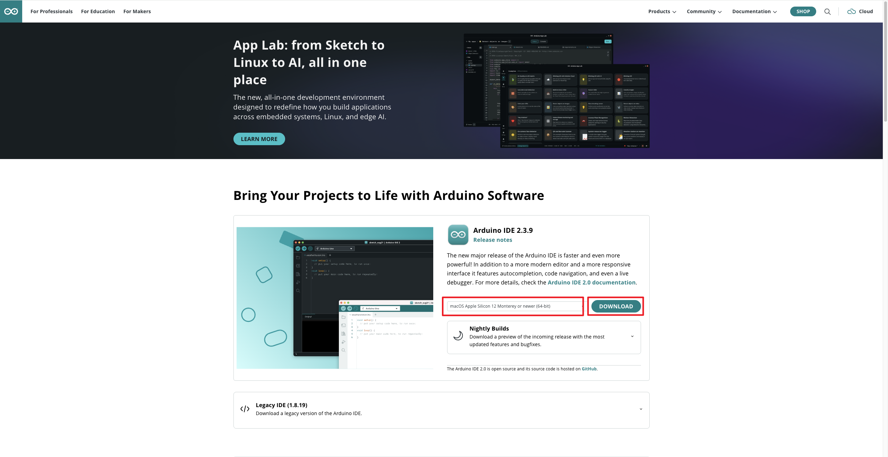
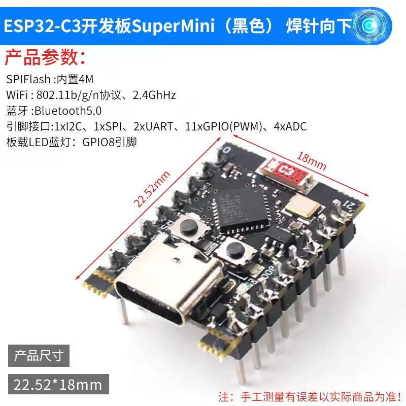
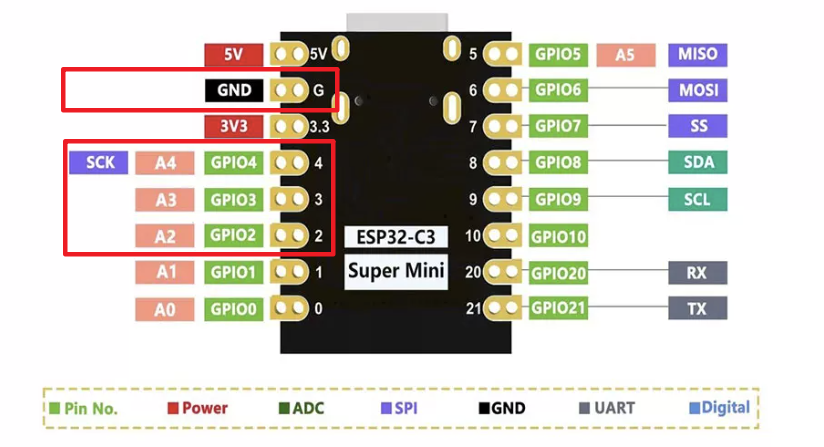
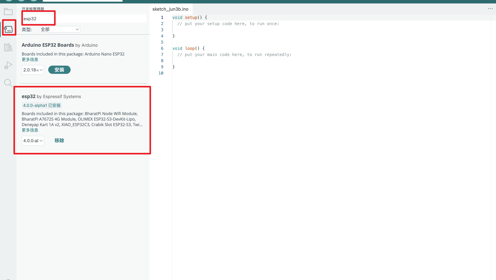
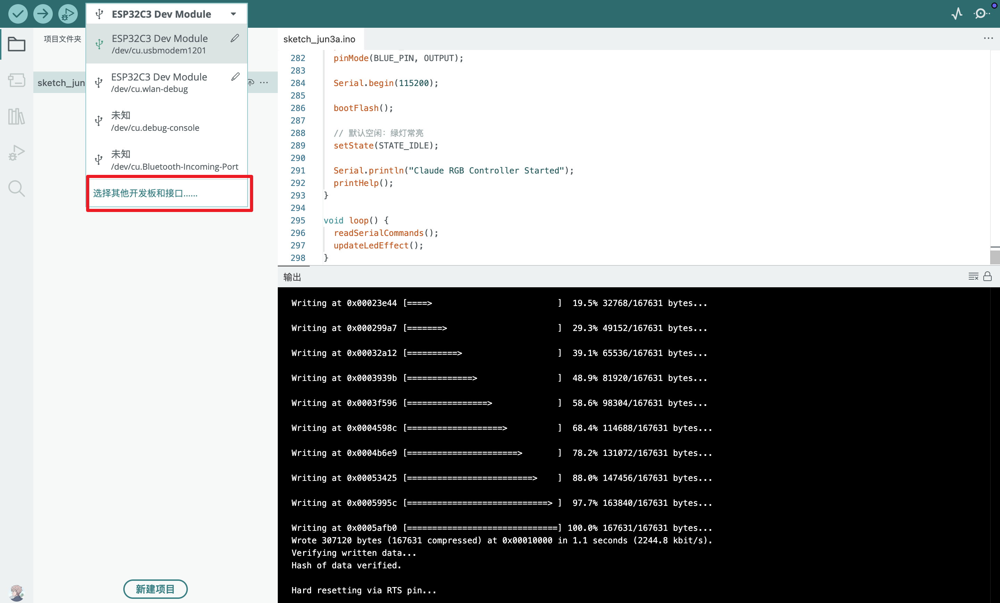
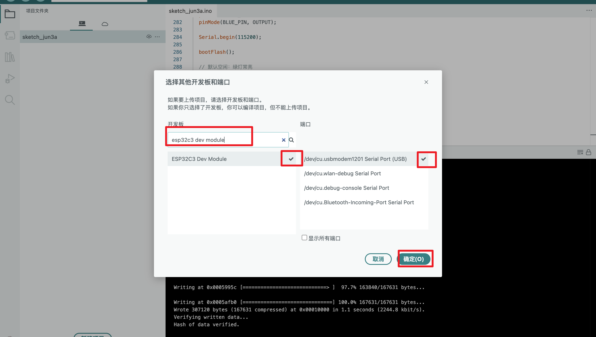
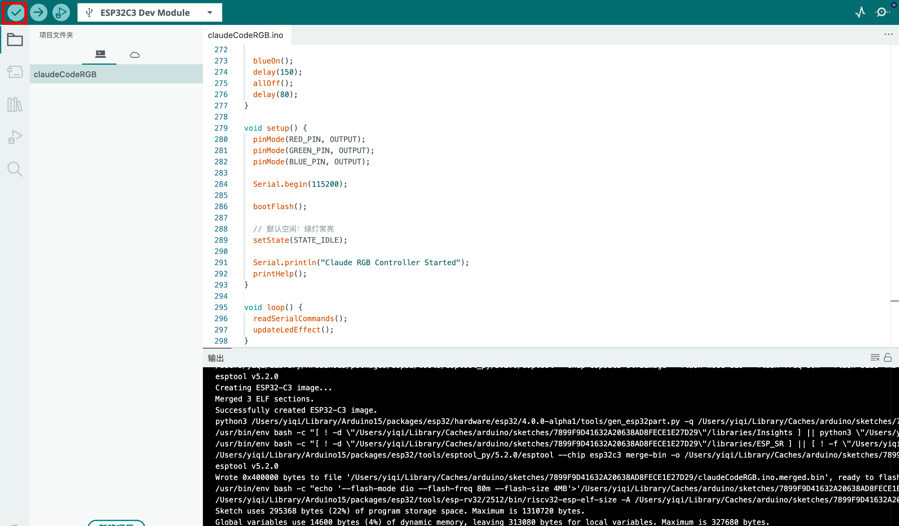

# ClaudeCodeRGB

基于 ESP32C3 Super Mini + RGB 灯模块(共阴) 实现的指示灯系统。

<details>
<summary>目录</summary>

[toc]

</details>

## 成果展示

<table>
  <tr>
    <td align="center">
      <b>🟢 绿灯 — idle / done</b><br><br>
      
    </td>
    <td align="center">
      <b>🔴 红灯 — error</b><br><br>
      <video src="./result/红灯.mp4" width="300" controls></video>
    </td>
  </tr>
  <tr>
    <td align="center">
      <b>🟡 黄灯 — ask</b><br><br>
      <video src="./result/黄灯.mp4" width="300" controls></video>
    </td>
    <td align="center">
      <b>🔵➡️🟣➡️🔵 蓝转紫转蓝 — running → tool → running</b><br><br>
      <video src="./result/蓝转紫转蓝灯.mp4" width="300" controls></video>
    </td>
  </tr>
</table>

---

## 软硬件环境

### 电脑

| 项目 | 说明 |
|------|------|
| 系统 | macOS 26.5.1 |

### 软件

| 名称 | 作用 | 版本 | 收费 | 下载地址 |
|------|------|------|------|----------|
| Arduino IDE | 烧录程序 | 2.3.9 | 免费 | [官网下载](https://www.arduino.cc/en/software/) |

<details>
<summary>📷 查看截图</summary>



</details>

### 硬件

| # | 名称 | 价格 | 购买地址 | 备注 |
|---|------|------|----------|------|
| 1 | Type-C 数据线 | 2.13 元 | [淘宝链接](https://item.taobao.com/item.htm?id=734206474044&mi_id=0000z-VobxuyIgyOhcNoR8ovWlwF-aQOBVOH6uVJRoKuDAI&skuId=5247366846668&spm=tbpc.boughtlist.suborder_itemtitle.1.599f2e8dgGGenX) | 已有 Type-C 线可不买 |
| 2 | ESP32C3 SuperMini 模块 | 10 元 | [天猫链接](https://detail.tmall.com/item.htm?id=792938098209&mi_id=0000tlEOX1sNYD7-LX3Et2qIvKGHNW8g_uO0WJHa-kg8uhA&skuId=5584672027421&spm=tbpc.boughtlist.suborder_itemtitle.1.599f2e8dgGGenX) | 动手能力强可买不焊接版，便宜 5 毛钱 |
| 3 | 电子积木全彩 RGB 模块(共阴配4P线) | 11.87 元 | [天猫链接](https://detail.tmall.com/item.htm?id=610156877546&mi_id=0000UlnE1E-fWWXJaWEfJdVGbDJ5KWKxlMBt6mbrLw2hD78&skuId=5924593772549&spm=tbpc.boughtlist.suborder_itemtitle.1.599f2e8dgGGenX) | 可买不带壳版；自带杜邦线最低 2.07 元 |
| 4 | 杜邦线 × 4 | — | — | 购买带线版 RGB 模块则无需准备 |

#### 硬件图片

<details>
<summary>📷 Type-C 数据线</summary>


</details>

<details>
<summary>📷 ESP32C3 SuperMini 模块</summary>



</details>

<details>
<summary>📷 RGB 灯模块</summary>


</details>

## 具体实现

### 接线



#### 接线表

| RGB 模块 | ESP32-C3 SuperMini |
| ------ | ------------------ |
| R      | GPIO2              |
| G      | GPIO3              |
| B      | GPIO4              |
| GND    | GND                |

#### 最终接线

```txt
电脑  --> USB线 --> 开发板 --> RGB灯模块
```

### Arduino IDE烧录

#### 烧录前的准备

1. 通过USB Type-C数据线将ESP32C3SuperMini连接到计算机
2. 启动 Arduino 应用程序
3. 将 ESP32 板包添加到 Arduino IDE
   1. 导航到File > Preferences ，然后使用以下 url 填写“Additional Boards Manager URL” ：`https://raw.githubusercontent.com/espressif/arduino-esp32/gh-pages/package_esp32_index.json`
   2. 等待下载
   3. 导航到 Tools > Board > Boards Manager...，在搜索框中输入关键字 “esp32”，选择最新版本的 ESP32 并安装。
   4. 等待安装
   5. 选择开发板: 
   6. 选择开发板: 

#### 编码

此部分由 Claude Code 实现

| 状态名       | 指令          | 灯效       |
| --------- | ----------- | -------- |
| `idle`    | 空闲          | 绿色常亮       |
| `running` | Claude 正在运行 | 蓝色慢闪     |
| `tool`    | 正在调用工具      | 紫色快闪     |
| `ask`     | 等待用户输入 / 权限 | 黄色快闪     |
| `done`    | 运行完成        | 绿色常亮  |
| `error`   | 出错          | 红色快闪     |

<details>
<summary>硬件程序</summary>

```ino
// ESP32-C3 SuperMini + 共阴极 4P RGB 模块
// Claude Code RGB 状态灯
//
// 支持串口命令：
// STATE:idle
// STATE:done
// STATE:running
// STATE:tool
// STATE:ask
// STATE:error
// PING
// HELP
//
// 共阴极逻辑：HIGH = 亮，LOW = 灭

#define RED_PIN    2
#define GREEN_PIN  3
#define BLUE_PIN   4

enum LedState {
  STATE_IDLE,
  STATE_DONE,
  STATE_RUNNING,
  STATE_TOOL,
  STATE_ASK,
  STATE_ERROR
};

LedState currentState = STATE_IDLE;

String inputLine = "";

unsigned long lastEffectMs = 0;
bool blinkOn = true;

const unsigned long RUNNING_INTERVAL_MS = 500;  // 蓝灯慢闪
const unsigned long TOOL_INTERVAL_MS    = 150;  // 紫灯快闪
const unsigned long ASK_INTERVAL_MS     = 250;  // 黄灯快闪
const unsigned long ERROR_INTERVAL_MS   = 100;  // 红灯快闪

void setColor(bool red, bool green, bool blue) {
  digitalWrite(RED_PIN, red ? HIGH : LOW);
  digitalWrite(GREEN_PIN, green ? HIGH : LOW);
  digitalWrite(BLUE_PIN, blue ? HIGH : LOW);
}

void allOff() {
  setColor(false, false, false);
}

void greenOn() {
  setColor(false, true, false);
}

void blueOn() {
  setColor(false, false, true);
}

void purpleOn() {
  setColor(true, false, true);
}

void yellowOn() {
  setColor(true, true, false);
}

void redOn() {
  setColor(true, false, false);
}

const char* stateName(LedState state) {
  switch (state) {
    case STATE_IDLE:    return "idle";
    case STATE_DONE:    return "done";
    case STATE_RUNNING: return "running";
    case STATE_TOOL:    return "tool";
    case STATE_ASK:     return "ask";
    case STATE_ERROR:   return "error";
    default:            return "unknown";
  }
}

void applyImmediateColor() {
  switch (currentState) {
    case STATE_IDLE:
    case STATE_DONE:
      greenOn();
      break;

    case STATE_RUNNING:
      blueOn();
      break;

    case STATE_TOOL:
      purpleOn();
      break;

    case STATE_ASK:
      yellowOn();
      break;

    case STATE_ERROR:
      redOn();
      break;
  }
}

void setState(LedState newState) {
  currentState = newState;
  lastEffectMs = millis();
  blinkOn = true;

  applyImmediateColor();

  Serial.print("OK STATE:");
  Serial.println(stateName(currentState));
}

void printHelp() {
  Serial.println("Claude RGB Ready");
  Serial.println("Commands:");
  Serial.println("  STATE:idle");
  Serial.println("  STATE:done");
  Serial.println("  STATE:running");
  Serial.println("  STATE:tool");
  Serial.println("  STATE:ask");
  Serial.println("  STATE:error");
  Serial.println("  PING");
  Serial.println("  HELP");
}

void handleCommand(String cmd) {
  cmd.trim();

  if (cmd.length() == 0) {
    return;
  }

  String original = cmd;

  cmd.toLowerCase();

  if (cmd == "ping") {
    Serial.print("PONG STATE:");
    Serial.println(stateName(currentState));
    return;
  }

  if (cmd == "help") {
    printHelp();
    return;
  }

  if (cmd.startsWith("state:")) {
    cmd = cmd.substring(6);
    cmd.trim();
  }

  if (cmd == "idle") {
    setState(STATE_IDLE);
  } else if (cmd == "done") {
    setState(STATE_DONE);
  } else if (cmd == "running") {
    setState(STATE_RUNNING);
  } else if (cmd == "tool") {
    setState(STATE_TOOL);
  } else if (cmd == "ask") {
    setState(STATE_ASK);
  } else if (cmd == "error") {
    setState(STATE_ERROR);
  } else {
    Serial.print("ERR UNKNOWN_COMMAND:");
    Serial.println(original);
  }
}

void readSerialCommands() {
  while (Serial.available() > 0) {
    char c = Serial.read();

    if (c == '\n' || c == '\r') {
      if (inputLine.length() > 0) {
        handleCommand(inputLine);
        inputLine = "";
      }
    } else {
      inputLine += c;

      // 防止异常输入占用内存
      if (inputLine.length() > 100) {
        inputLine = "";
        Serial.println("ERR INPUT_TOO_LONG");
      }
    }
  }
}

void updateLedEffect() {
  unsigned long now = millis();

  switch (currentState) {
    case STATE_IDLE:
    case STATE_DONE:
      greenOn();
      break;

    case STATE_RUNNING:
      if (now - lastEffectMs >= RUNNING_INTERVAL_MS) {
        lastEffectMs = now;
        blinkOn = !blinkOn;
      }

      if (blinkOn) {
        blueOn();
      } else {
        allOff();
      }
      break;

    case STATE_TOOL:
      if (now - lastEffectMs >= TOOL_INTERVAL_MS) {
        lastEffectMs = now;
        blinkOn = !blinkOn;
      }

      if (blinkOn) {
        purpleOn();
      } else {
        allOff();
      }
      break;

    case STATE_ASK:
      if (now - lastEffectMs >= ASK_INTERVAL_MS) {
        lastEffectMs = now;
        blinkOn = !blinkOn;
      }

      if (blinkOn) {
        yellowOn();
      } else {
        allOff();
      }
      break;

    case STATE_ERROR:
      if (now - lastEffectMs >= ERROR_INTERVAL_MS) {
        lastEffectMs = now;
        blinkOn = !blinkOn;
      }

      if (blinkOn) {
        redOn();
      } else {
        allOff();
      }
      break;
  }
}

void bootFlash() {
  // 上电自检：红、绿、蓝各闪一次
  redOn();
  delay(150);
  allOff();
  delay(80);

  greenOn();
  delay(150);
  allOff();
  delay(80);

  blueOn();
  delay(150);
  allOff();
  delay(80);
}

void setup() {
  pinMode(RED_PIN, OUTPUT);
  pinMode(GREEN_PIN, OUTPUT);
  pinMode(BLUE_PIN, OUTPUT);

  Serial.begin(115200);

  bootFlash();

  // 默认空闲：绿灯常亮
  setState(STATE_IDLE);

  Serial.println("Claude RGB Controller Started");
  printHelp();
}

void loop() {
  readSerialCommands();
  updateLedEffect();
}
```

</details>

#### 烧录与调试

> Q1 Arduino上无法识别Com口 进入下载模式：
> 方式1：按住BOOT上电。
> 方式2：按住ESP32C3的BOOT按键，然后按下RESET按键，松开RESET按键，再松开BOOT按键，此时ESP32C3会进入下载模式。（每次连接都需要重新进入下载模式，有时按一遍，端口不稳定会断开，可以通过端口识别声音来判断）
> 
> Q2：上传之后程序无法运行。上传成功后需要按一下 Reset 按键，程序才会执行。
>
> Q3：ESP32-C3 SuperMini Arduino 串口无法打印。需要将工具栏中 "USB CDC On Boot" 设置成 "Enabled"。

##### 验证



##### 写入


##### Arduino IDE 中测试

> 确保写入完成

按下 Reset 键（程序内置上电自检逻辑：红灯闪烁一次 → 绿灯闪烁一次 → 蓝灯闪烁一次 → 绿灯常亮）

| 问题          | 处理                             |
| ----------- | ------------------------------ |
| RGB 完全不亮    | 检查 GND 是否接到共阴极公共脚              |
| 颜色错乱        | R/G/B 线接反，换线或改代码 pin           |
| 上传后串口消失     | 确认 `USB CDC On Boot = Enabled` |
| 一运行就 USB 断开 | 电源、USB 线、外设短路优先排查              |

打开 Arduino IDE 的 Serial Monitor：

输入：
```
PING
```

正常返回：
```
PONG STATE:idle
```

测试状态：
```
STATE:running
```

预期：蓝灯慢闪。

继续测试：
```
STATE:tool
STATE:ask
STATE:error
STATE:done
STATE:idle
```

对应：

|输入|预期灯效|
|---|---|
|`STATE:running`|蓝灯慢闪|
|`STATE:tool`|紫灯快闪|
|`STATE:ask`|黄灯快闪|
|`STATE:error`|红灯快闪|
|`STATE:done`|绿灯常亮|
|`STATE:idle`|绿灯常亮|

##### 终端中测试

> 测试前先关闭 Arduino IDE 的串口监视器，否则 Python 或 shell 可能无法占用串口。

查询串口

```bash
find /dev \
  \( -name 'cu.usbmodem*' \
  -o -name 'cu.usbserial*' \
  -o -name 'cu.wchusbserial*' \
  -o -name 'cu.SLAB_USBtoUART*' \) \
  -maxdepth 1
```

返回(这里你的电脑可能会不一样):

```bash
/dev/cu.usbmodem1201
```

执行命令

```bash
printf 'STATE:running\n' > /dev/cu.usbmodem1201
```

分别执行命令

```bash
printf 'STATE:tool\n' > /dev/cu.usbmodem1201
printf 'STATE:ask\n' > /dev/cu.usbmodem1201
printf 'STATE:error\n' > /dev/cu.usbmodem1201
printf 'STATE:done\n' > /dev/cu.usbmodem1201
```

### Python脚本

#### 编码

> 在`~/.claude/hooiks/`目录创建 `claude_rgb_hook.py` 文件

> 此部分也由 Claude Code 实现，以下是示例

<details>
<summary>claude_rgb_hook.py</summary>

```python
#!/usr/bin/env python3  
import argparse  
import glob  
import json  
import os  
import sys  
import time  
import termios  
from typing import Any, Dict, Optional  
  
  
DEFAULT_PORT = "/dev/cu.usbmodem1201"  
DEFAULT_BAUD = 115200  
  
VALID_STATES = {  
    "idle",  
    "done",  
    "running",  
    "tool",  
    "ask",  
    "error",  
}  
  
PORT_PATTERNS = [  
    # macOS  
    "/dev/cu.usbmodem*",  
    "/dev/cu.usbserial*",  
    "/dev/cu.wchusbserial*",  
    "/dev/cu.SLAB_USBtoUART*",  
  
    # Linux  
    "/dev/ttyACM*",  
    "/dev/ttyUSB*",  
]  
  
  
def log(message: str) -> None:  
    log_path = os.environ.get("CLAUDE_RGB_LOG", "")  
    if not log_path:  
        return  
  
    log_path = os.path.expanduser(log_path)  
  
    try:  
        os.makedirs(os.path.dirname(log_path), exist_ok=True)  
        with open(log_path, "a", encoding="utf-8") as f:  
            f.write(f"{time.strftime('%Y-%m-%d %H:%M:%S')} {message}\n")  
    except Exception:  
        # 日志失败不能影响 Claude Code        pass  
  
  
def scan_ports() -> list[str]:  
    ports: list[str] = []  
  
    for pattern in PORT_PATTERNS:  
        ports.extend(glob.glob(pattern))  
  
    return sorted(set(ports))  
  
  
def pick_serial_port(cli_port: Optional[str] = None) -> Optional[str]:  
    if cli_port:  
        return cli_port  
  
    env_port = os.environ.get("CLAUDE_RGB_PORT")  
    if env_port:  
        return env_port  
  
    if os.path.exists(DEFAULT_PORT):  
        return DEFAULT_PORT  
  
    ports = scan_ports()  
    if ports:  
        return ports[0]  
  
    return None  
  
  
def baud_to_termios(baud: int) -> int:  
    if baud == 9600:  
        return termios.B9600  
    if baud == 19200:  
        return termios.B19200  
    if baud == 38400:  
        return termios.B38400  
    if baud == 57600:  
        return termios.B57600  
    if baud == 115200:  
        return termios.B115200  
  
    # 默认 115200    return termios.B115200  
  
  
def configure_serial(fd: int, baud: int) -> None:  
    attrs = termios.tcgetattr(fd)  
  
    # Input flags  
    attrs[0] &= ~(  
        termios.IGNBRK  
        | termios.BRKINT  
        | termios.PARMRK  
        | termios.ISTRIP  
        | termios.INLCR  
        | termios.IGNCR  
        | termios.ICRNL  
        | termios.IXON  
    )  
  
    # Output flags  
    attrs[1] &= ~termios.OPOST  
  
    # Control flags: 8N1  
    attrs[2] &= ~termios.CSIZE  
    attrs[2] |= termios.CS8  
    attrs[2] &= ~termios.PARENB  
    attrs[2] &= ~termios.CSTOPB  
  
    if hasattr(termios, "CREAD"):  
        attrs[2] |= termios.CREAD  
    if hasattr(termios, "CLOCAL"):  
        attrs[2] |= termios.CLOCAL  
  
    # Local flags  
    attrs[3] &= ~(termios.ECHO | termios.ECHONL | termios.ICANON | termios.ISIG)  
  
    if hasattr(termios, "IEXTEN"):  
        attrs[3] &= ~termios.IEXTEN  
  
    speed = baud_to_termios(baud)  
    attrs[4] = speed  
    attrs[5] = speed  
  
    # VMIN / VTIME  
    attrs[6][termios.VMIN] = 0  
    attrs[6][termios.VTIME] = 5  
  
    termios.tcsetattr(fd, termios.TCSANOW, attrs)  
  
  
def write_state_to_serial(state: str, port: Optional[str] = None, baud: int = DEFAULT_BAUD) -> bool:  
    state = state.strip().lower()  
  
    if state not in VALID_STATES:  
        log(f"Invalid state: {state}")  
        return False  
  
    picked_port = pick_serial_port(port)  
  
    if not picked_port:  
        log("No serial port found")  
        return False  
  
    payload = f"STATE:{state}\n".encode("utf-8")  
  
    try:  
        fd = os.open(picked_port, os.O_RDWR | os.O_NOCTTY | os.O_NONBLOCK)  
  
        try:  
            configure_serial(fd, baud)  
  
            # 连续发送两次，降低偶发丢包概率  
            os.write(fd, payload)  
            time.sleep(0.04)  
            os.write(fd, payload)  
  
            try:  
                termios.tcdrain(fd)  
            except Exception:  
                pass  
  
            log(f"sent STATE:{state} to {picked_port}")  
            return True  
  
        finally:  
            os.close(fd)  
  
    except Exception as e:  
        log(f"serial write failed: port={picked_port}, error={repr(e)}")  
        return False  
  
  
def read_hook_input() -> Dict[str, Any]:  
    try:  
        raw = sys.stdin.read()  
  
        if not raw.strip():  
            return {}  
  
        data = json.loads(raw)  
  
        if isinstance(data, dict):  
            return data  
  
        return {}  
  
    except Exception as e:  
        log(f"failed to read hook input: {repr(e)}")  
        return {}  
  
  
def state_from_hook(data: Dict[str, Any]) -> Optional[str]:  
    event = data.get("hook_event_name", "")  
    tool_name = data.get("tool_name", "")  
    notification_type = data.get("notification_type", "")  
  
    # Claude Code 会在新会话、恢复会话等场景触发 SessionStart    if event == "SessionStart":  
        return "idle"  
  
    if event == "SessionEnd":  
        return "idle"  
  
    # 用户提交 prompt 后，Claude 开始处理  
    if event == "UserPromptSubmit":  
        return "running"  
  
    # 工具调用前：显示 tool    # AskUserQuestion / ExitPlanMode 本质上是等用户介入，显示 ask    if event == "PreToolUse":  
        if tool_name in {"AskUserQuestion", "ExitPlanMode"}:  
            return "ask"  
        return "tool"  
  
    # 工具成功后：回到 running    if event == "PostToolUse":  
        return "running"  
  
    # 工具失败：错误  
    if event == "PostToolUseFailure":  
        return "error"  
  
    # 即将弹权限确认框：等待用户  
    if event == "PermissionRequest":  
        return "ask"  
  
    # 用户拒绝权限：错误/中断态  
    if event == "PermissionDenied":  
        return "error"  
  
    # Claude 等待输入或权限时会触发 Notification    if event == "Notification":  
        if notification_type == "permission_prompt":  
            return "ask"  
  
        if notification_type == "elicitation_dialog":  
            return "ask"  
  
        # 关键修复：idle_prompt 不再映射为 ask        if notification_type == "idle_prompt":  
            return None  
  
        return None  
    # 主 agent 完成本轮响应  
    if event == "Stop":  
        return "done"  
  
    # API / 鉴权 / 模型等异常  
    if event == "StopFailure":  
        return "error"  
  
    return None  
  
  
def parse_args() -> argparse.Namespace:  
    parser = argparse.ArgumentParser(  
        description="Claude Code RGB hook for ESP32-C3"  
    )  
  
    parser.add_argument(  
        "state",  
        nargs="?",  
        help="Manual test state: idle, done, running, tool, ask, error"  
    )  
  
    parser.add_argument(  
        "--port",  
        default=None,  
        help=f"Serial port, default from CLAUDE_RGB_PORT or {DEFAULT_PORT}"  
    )  
  
    parser.add_argument(  
        "--baud",  
        type=int,  
        default=DEFAULT_BAUD,  
        help="Serial baud rate, default 115200"  
    )  
  
    parser.add_argument(  
        "--scan",  
        action="store_true",  
        help="List candidate serial ports"  
    )  
  
    parser.add_argument(  
        "--print-input",  
        action="store_true",  
        help="Debug: print stdin JSON parsed from Claude Code hook"  
    )  
  
    return parser.parse_args()  
  
  
def main() -> int:  
    args = parse_args()  
  
    if args.scan:  
        ports = scan_ports()  
        for port in ports:  
            print(port)  
        return 0  
  
    # 手动测试模式：  
    # ~/.claude/hooks/claude_rgb_hook.py running  
    if args.state:  
        state = args.state.strip().lower()  
  
        if state not in VALID_STATES:  
            print(f"Invalid state: {state}", file=sys.stderr)  
            print(f"Valid states: {', '.join(sorted(VALID_STATES))}", file=sys.stderr)  
            return 1  
  
        ok = write_state_to_serial(state, port=args.port, baud=args.baud)  
  
        if not ok:  
            print("Failed to write serial.", file=sys.stderr)  
            print("Check ESP32 connection and CLAUDE_RGB_PORT.", file=sys.stderr)  
            return 1  
  
        return 0  
  
    # Claude Code hook 模式  
    data = read_hook_input()  
  
    if args.print_input:  
        print(json.dumps(data, ensure_ascii=False, indent=2), file=sys.stderr)  
  
    state = state_from_hook(data)  
  
    if state:  
        write_state_to_serial(state, port=args.port, baud=args.baud)  
  
    # 关键：RGB hook 不应阻断 Claude Code    return 0  
  
  
if __name__ == "__main__":  
    raise SystemExit(main())
```

</details>

#### 测试

##### 赋权

```bash
chmod +x ~/.claude/hooks/claude_rgb_hook.py
```

##### 扫描串口

```bash
~/.claude/hooks/claude_rgb_hook.py --scan
```

返回
> 这里可能返回其他串口, 请注意:

```bash
/dev/cu.usbmodem1201
```

设置环境变量

```bash
export CLAUDE_RGB_PORT=/dev/cu.usbmodem1201
```

可选：打开日志。

```bash
export CLAUDE_RGB_LOG=$HOME/.claude/logs/rgb-hook.log
```

手动测试状态

```bash
~/.claude/hooks/claude_rgb_hook.py running
```
预期：蓝灯慢闪。

继续测试：

```bash
~/.claude/hooks/claude_rgb_hook.py tool
~/.claude/hooks/claude_rgb_hook.py ask
~/.claude/hooks/claude_rgb_hook.py error
~/.claude/hooks/claude_rgb_hook.py done
~/.claude/hooks/claude_rgb_hook.py idle
```

###### 测试 Hook JSON 输入

> 模拟 Claude Code 的 UserPromptSubmit：

```bash
echo '{"hook_event_name":"UserPromptSubmit","prompt":"test"}' \
  | ~/.claude/hooks/claude_rgb_hook.py
```
预期：蓝灯慢闪。

> 模拟工具调用：

```bash
echo '{"hook_event_name":"PreToolUse","tool_name":"Bash","tool_input":{"command":"ls"}}' \
  | ~/.claude/hooks/claude_rgb_hook.py
```
预期：紫灯快闪。

> 模拟等待权限：

```bash
echo '{"hook_event_name":"Notification","notification_type":"permission_prompt","message":"Claude needs your permission"}' \
  | ~/.claude/hooks/claude_rgb_hook.py
```
预期：黄灯快闪。

> 模拟任务完成：

```bash
echo '{"hook_event_name":"Stop","last_assistant_message":"done"}' \
  | ~/.claude/hooks/claude_rgb_hook.py
```
预期：黄灯快闪。

> 模拟错误：

```bash
echo '{"hook_event_name":"PostToolUseFailure","tool_name":"Bash","error":"failed"}' \
  | ~/.claude/hooks/claude_rgb_hook.py
```
预期：红灯快闪。

##### 查看日志

如果你设置了 CLAUDE_RGB_LOG：

```bash
cat ~/.claude/logs/rgb-hook.log
```

如果没有日志，确认目录位置：

```bash
echo $CLAUDE_RGB_LOG
```

### 配置 Claude Code Hooks

Claude Code 的 user 级配置文件是：

```bash
~/.claude/settings.json
```

官方文档说明：

- user settings 作用于所有项目
- project settings 放在项目里的 `.claude/settings.json`
- local settings 放在 `.claude/settings.local.json`

如果你希望所有项目都用这个 RGB 状态灯，编辑：

```bash
nano ~/.claude/settings.json
```

<details>
<summary>具体配置</summary>

```json
{
  "env": {
    "CLAUDE_RGB_PORT": "/dev/cu.usbmodem1201",
    "CLAUDE_RGB_LOG": "~/.claude/logs/rgb-hook.log"
  },
  "hooks": {
    "SessionStart": [
      {
        "matcher": "startup|resume|clear|compact",
        "hooks": [
          {
            "type": "command",
            "command": "$HOME/.claude/hooks/claude_rgb_hook.py",
            "async": true,
            "timeout": 2
          }
        ]
      }
    ],
    "SessionEnd": [
      {
        "matcher": "",
        "hooks": [
          {
            "type": "command",
            "command": "$HOME/.claude/hooks/claude_rgb_hook.py",
            "async": true,
            "timeout": 2
          }
        ]
      }
    ],
    "UserPromptSubmit": [
      {
        "matcher": "",
        "hooks": [
          {
            "type": "command",
            "command": "$HOME/.claude/hooks/claude_rgb_hook.py",
            "async": true,
            "timeout": 2
          }
        ]
      }
    ],
    "PreToolUse": [
      {
        "matcher": "*",
        "hooks": [
          {
            "type": "command",
            "command": "$HOME/.claude/hooks/claude_rgb_hook.py",
            "async": true,
            "timeout": 2
          }
        ]
      }
    ],
    "PostToolUse": [
      {
        "matcher": "*",
        "hooks": [
          {
            "type": "command",
            "command": "$HOME/.claude/hooks/claude_rgb_hook.py",
            "async": true,
            "timeout": 2
          }
        ]
      }
    ],
    "PostToolUseFailure": [
      {
        "matcher": "*",
        "hooks": [
          {
            "type": "command",
            "command": "$HOME/.claude/hooks/claude_rgb_hook.py",
            "async": true,
            "timeout": 2
          }
        ]
      }
    ],
    "PermissionRequest": [
      {
        "matcher": "*",
        "hooks": [
          {
            "type": "command",
            "command": "$HOME/.claude/hooks/claude_rgb_hook.py",
            "async": true,
            "timeout": 2
          }
        ]
      }
    ],
    "PermissionDenied": [
      {
        "matcher": "*",
        "hooks": [
          {
            "type": "command",
            "command": "$HOME/.claude/hooks/claude_rgb_hook.py",
            "async": true,
            "timeout": 2
          }
        ]
      }
    ],
    "Notification": [
      {
        "matcher": "permission_prompt|elicitation_dialog",
        "hooks": [
          {
            "type": "command",
            "command": "$HOME/.claude/hooks/claude_rgb_hook.py",
            "async": true,
            "timeout": 2
          }
        ]
      }
    ],
    "Stop": [
      {
        "matcher": "",
        "hooks": [
          {
            "type": "command",
            "command": "$HOME/.claude/hooks/claude_rgb_hook.py",
            "async": true,
            "timeout": 2
          }
        ]
      }
    ],
    "StopFailure": [
      {
        "matcher": "*",
        "hooks": [
          {
            "type": "command",
            "command": "$HOME/.claude/hooks/claude_rgb_hook.py",
            "async": true,
            "timeout": 2
          }
        ]
      }
    ]
  }
}
```

</details>

#### 测试Claude Code

##### 测试 `running`

在 Claude Code 输入一个简单任务：

```text
帮我列出当前目录下的文件
```

你应该看到：

```text
绿灯常亮 → 蓝灯慢闪
```

##### 测试 `tool`

让 Claude 执行工具，例如：

```text
运行 pwd
```

当 Claude 调用 Bash 前，应该短暂进入：

```text
紫灯快闪
```

工具完成后回到：

```text
蓝灯慢闪
```

##### 测试 `ask`

让 Claude 执行一个需要权限确认的命令，例如：

```text
运行 ls -la
```

如果 Claude Code 弹出权限确认，灯应该变成：

```text
黄灯快闪
```

官方文档说明 `PermissionRequest` 会在权限对话框即将展示时触发；`Notification` 的 `permission_prompt` 也用于 Claude 需要权限时通知。([Claude Code][1])

##### 测试 `done`

Claude 回复结束后，`Stop` 触发，灯应该变成：

```text
绿灯常亮
```

官方文档说明 `Stop` 在主 Claude Code agent 完成响应时运行。([Claude Code][1])

---

## 常见故障定位

### 问题 A：Arduino 串口监视器能控制灯，但 Python 不行

检查 Python 是否可执行：

```bash
ls -l ~/.claude/hooks/claude_rgb_hook.py
```

应该看到有 `x` 权限。

没有就执行：

```bash
chmod +x ~/.claude/hooks/claude_rgb_hook.py
```

然后手动测试：

```bash
CLAUDE_RGB_PORT=/dev/cu.usbmodem1201 ~/.claude/hooks/claude_rgb_hook.py ask
```

### 问题 B：Python 手动测试可以，但 Claude Code 不触发

检查配置：

```bash
python3 -m json.tool ~/.claude/settings.json >/dev/null && echo "JSON OK"
```

再进入 Claude Code：

```text
/hooks
```

确认相关事件确实显示了 hook。

### 问题 C：日志没有生成

先创建目录：

```bash
mkdir -p ~/.claude/logs
```

然后手动运行：

```bash
CLAUDE_RGB_PORT=/dev/cu.usbmodem1201 \
CLAUDE_RGB_LOG=$HOME/.claude/logs/rgb-hook.log \
~/.claude/hooks/claude_rgb_hook.py running
```

查看：

```bash
cat ~/.claude/logs/rgb-hook.log
```

### 问题 D：串口被占用

关闭：

* Arduino IDE Serial Monitor
* 其他串口调试工具
* 任何正在连接 `/dev/cu.usbmodem1201` 的程序

再测试：

```bash
~/.claude/hooks/claude_rgb_hook.py done
```

### 问题 E：灯效颜色不对

直接在 Arduino 串口监视器输入：

```text
STATE:error
```

如果不是红灯，说明 R/G/B 线接错。处理方式二选一：

1. 重新接线；
2. 修改代码里的 GPIO 定义：

```cpp
#define RED_PIN    2
#define GREEN_PIN  3
#define BLUE_PIN   4
```

---

## 你最终应该得到的行为

```text
Claude Code 未运行 / 已完成
  → 绿灯常亮

你提交 prompt
  → 蓝灯慢闪

Claude 调用 Read / Bash / Edit / Write 等工具
  → 紫灯快闪

Claude 等你确认权限 / 等你输入
  → 黄灯快闪

Claude 工具执行失败 / StopFailure
  → 红灯快闪
```

配置里使用了 `"async": true`，官方文档说明异步 command hook 会在后台运行，Claude Code 不会等待 hook 完成；这正适合 RGB 状态灯这种副作用型集成。

---

## 功能列表

### ✅ 已实现

- [x] 点灯
- [x] 烧录程序
- [x] 对接 Claude Code，实现 CC 不同状态下的灯光变化（idle / running / tool / ask / done / error）

### 🚧 暂未实现

- [ ] 3D 打印外壳（急需懂 3D 打印的同学帮助）
- [ ] 基于 WiFi 或蓝牙实现无线状态灯（使用充电宝供电）
- [ ] 焊接电池模块实现真正意义上的无线状态灯（产品化）

### 💡 可能的优化方案

1. **更轻量的硬件方案**：找一款更轻量级、更便宜的开发板，或者自己定制（本人不擅长硬件，急需懂硬件的同学帮助）
2. **产品分级**：
   - **A 档**：仅三色灯（有线）
   - **B 档**：三色灯 + 蜂鸣器（有线）
   - **C 档**：三色灯（WiFi 无线）
   - ...
