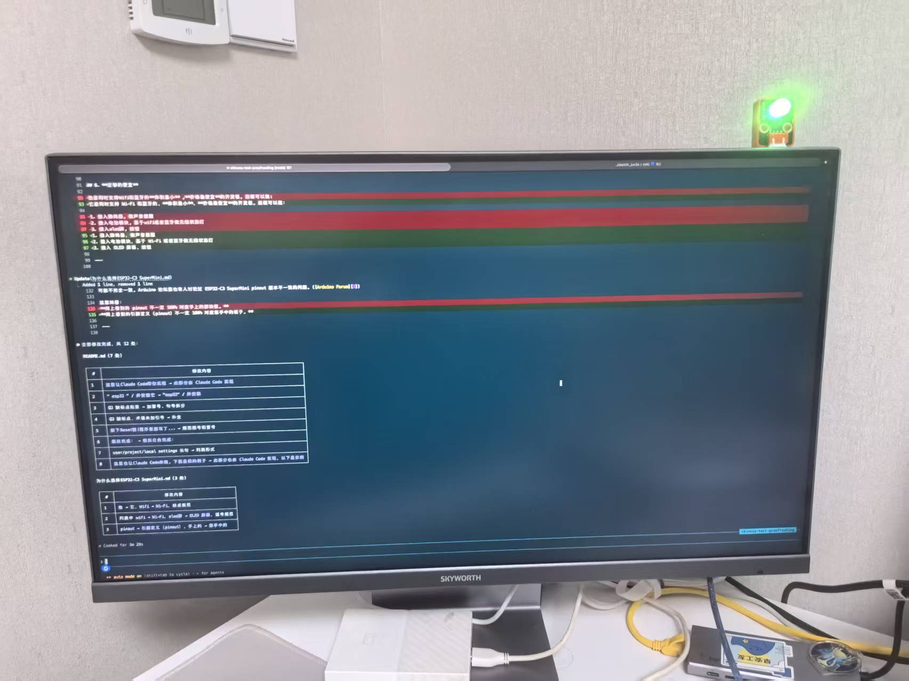
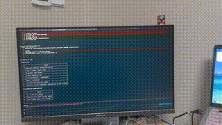
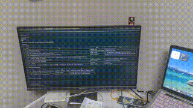
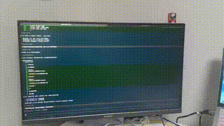

# ClaudeCodeRGB

基于 ESP32C3 Super Mini + RGB 灯模块(共阴) 实现的Claude Code指示灯系统。

## 成果展示

<table>
  <tr>
    <td align="center">
      <b>🟢 绿灯 — idle / done</b><br><br>
      
    </td>
    <td align="center">
      <b>🔴 红灯 — error</b><br><br>
      
    </td>
  </tr>
  <tr>
    <td align="center">
      <b>🟡 黄灯 — ask</b><br><br>
      
    </td>
    <td align="center">
      <b>🔵➡️🟣➡️🔵 蓝转紫转蓝 — running → tool → running</b><br><br>
      
    </td>
  </tr>
</table>

> 📖 **硬件准备、接线、固件烧录、Python 脚本开发** 请参阅 [硬件准备与开发指南](./docs/hardware-guide.md)

---

## 一键部署

项目提供了一键部署脚本，自动完成 hook 脚本下载、环境变量配置、Claude Code settings 合并。

**前置条件**：已安装 `curl`（macOS/Linux 自带）和 `python3`。

```bash
# macOS / Linux / WSL2 — 部署到当前项目
curl -fsSL https://raw.githubusercontent.com/canyuda/ClaudeCodeRGB/main/install.sh | bash

# 部署到用户级（所有项目生效）
curl -fsSL https://raw.githubusercontent.com/canyuda/ClaudeCodeRGB/main/install.sh | bash -s -- --user
```

```powershell
# Windows (PowerShell) — 部署到当前项目
iwr -useb https://raw.githubusercontent.com/canyuda/ClaudeCodeRGB/main/install.ps1 | iex

# 部署到用户级（所有项目生效）
iwr -useb https://raw.githubusercontent.com/canyuda/ClaudeCodeRGB/main/install.ps1 -OutFile $env:TEMP\install_rgb.ps1; & $env:TEMP\install_rgb.ps1 -User
```

> Windows 如遇执行策略限制，先运行：
> ```powershell
> Set-ExecutionPolicy -Scope CurrentUser -ExecutionPolicy RemoteSigned
> ```

### 脚本执行流程

1. **系统检测** — 检查操作系统及 Python 环境
2. **下载 hook 脚本** — 从 GitHub 仓库下载 `claude_rgb_hook.py` 到目标目录
3. **配置串口** — 自动扫描可用串口，交互式设置 `CLAUDE_RGB_PORT`（必填）
4. **配置日志** — 交互式设置 `CLAUDE_RGB_LOG`（可选，留空关闭日志）
5. **合并配置** — 将 hooks 和 env 写入 settings 文件，**不影响已有配置**

两种模式对比：

| | `./install.sh` 或 `.\install.ps1` | `--user` / `-User` |
|---|---|---|
| 配置文件 | `.claude/settings.local.json` | `~/.claude/settings.json` |
| hook 脚本 | `.claude/hooks/claude_rgb_hook.py` | `~/.claude/hooks/claude_rgb_hook.py` |
| 生效范围 | 当前项目 | 所有项目 |
| 是否进 git | ❌ 不提交 | — |

---

## 配置 Claude Code Hooks

> 重要的事情说三遍
> **如果你使用了一键部署脚本，可以跳过本节，脚本已自动完成配置**。
> **如果你使用了一键部署脚本，可以跳过本节，脚本已自动完成配置**。
> **如果你使用了一键部署脚本，可以跳过本节，脚本已自动完成配置**。

Claude Code 的 user 级配置文件是：

**macOS / Linux：**

```bash
~/.claude/settings.json
```

**Windows：**

```powershell
$HOME\.claude\settings.json
```

官方文档说明：

- user settings 作用于所有项目
- project settings 放在项目里的 `.claude/settings.json`
- local settings 放在 `.claude/settings.local.json`

如果你希望所有项目都用这个 RGB 状态灯，编辑：

```bash
# macOS / Linux
nano ~/.claude/settings.json
```

```powershell
# Windows
notepad $HOME\.claude\settings.json
```

完整配置见 [`claude_settings.json`](./claude_settings.json)

> **Windows 注意事项**：`claude_settings.json` 中的 hook command 需要加 `python` 前缀：
> ```json
> "command": "python $HOME/.claude/hooks/claude_rgb_hook.py"
> ```

### 测试 Claude Code

#### 测试 `running`

在 Claude Code 输入一个简单任务：

```text
帮我列出当前目录下的文件
```

你应该看到：

```text
绿灯常亮 → 蓝灯慢闪
```

#### 测试 `tool`

让 Claude 执行工具，例如：

```text
运行 pwd
```

当 Claude 调用 Bash 前，应该短暂进入：

```text
紫灯快闪
```

工具完成后回到：

```text
蓝灯慢闪
```

#### 测试 `ask`

让 Claude 执行一个需要权限确认的命令，例如：

```text
运行 ls -la
```

如果 Claude Code 弹出权限确认，灯应该变成：

```text
黄灯快闪
```

官方文档说明 `PermissionRequest` 会在权限对话框即将展示时触发；`Notification` 的 `permission_prompt` 也用于 Claude 需要权限时通知。([Claude Code][1])

#### 测试 `done`

Claude 回复结束后，`Stop` 触发，灯应该变成：

```text
绿灯常亮
```

官方文档说明 `Stop` 在主 Claude Code agent 完成响应时运行。([Claude Code][1])

---

## 常见故障定位

### 问题 A：Python 手动测试可以，但 Claude Code 不触发

检查配置：

```bash
# macOS / Linux
python3 -m json.tool ~/.claude/settings.json >/dev/null && echo "JSON OK"
```

```powershell
# Windows
python -m json.tool $HOME\.claude\settings.json
```

再进入 Claude Code：

```text
/hooks
```

确认相关事件确实显示了 hook。

### 问题 B：日志没有生成

先创建目录：

```bash
# macOS / Linux
mkdir -p ~/.claude/logs
```

```powershell
# Windows
New-Item -ItemType Directory -Path "$HOME\.claude\logs" -Force
```

然后手动运行：

```bash
# macOS / Linux
CLAUDE_RGB_PORT=/dev/cu.usbmodem1201 \
CLAUDE_RGB_LOG=$HOME/.claude/logs/rgb-hook.log \
~/.claude/hooks/claude_rgb_hook.py running
```

```powershell
# Windows
$env:CLAUDE_RGB_PORT = "COM3"
$env:CLAUDE_RGB_LOG = "$HOME\.claude\logs\rgb-hook.log"
python $HOME\.claude\hooks\claude_rgb_hook.py running
```

查看：

```bash
# macOS / Linux
cat ~/.claude/logs/rgb-hook.log
```

```powershell
# Windows
Get-Content $HOME\.claude\logs\rgb-hook.log
```

### 问题 C：串口被占用

关闭：

* Arduino IDE Serial Monitor
* 其他串口调试工具
* macOS / Linux：任何正在连接 `/dev/cu.usbmodem1201` 的程序
* Windows：任何正在连接 `COM3` 的程序

再测试：

```bash
# macOS / Linux
~/.claude/hooks/claude_rgb_hook.py done
```

```powershell
# Windows
python $HOME\.claude\hooks\claude_rgb_hook.py done
```

> 硬件相关的故障排查（Python 串口通信、灯效颜色、Windows 模块错误）请参阅 [硬件准备与开发指南](./docs/hardware-guide.md#常见故障定位)

---

## 你最终应该得到的行为

```text
Claude Code 未运行 / 已完成
  → 绿灯常亮

你提交 prompt
  → 蓝灯慢闪

Claude 调用 Read / Bash / Edit / Write 等工具
  → 紫灯快闪

Claude 等你确认权限 / 等你输入
  → 黄灯快闪

Claude 工具执行失败 / StopFailure
  → 红灯快闪
```

配置里使用了 `"async": true`，官方文档说明异步 command hook 会在后台运行，Claude Code 不会等待 hook 完成；这正适合 RGB 状态灯这种副作用型集成。

---

## 功能列表

### ✅ 已实现

- [x] 点灯
- [x] 烧录程序
- [x] 对接 Claude Code，实现 CC 不同状态下的灯光变化（idle / running / tool / ask / done / error）
- [x] 跨平台支持（macOS / Linux / Windows）

### 🚧 暂未实现

- [ ] 3D 打印外壳（急需懂 3D 打印的同学帮助）
- [ ] 基于 WiFi 或蓝牙实现无线状态灯（使用充电宝供电）
- [ ] 焊接电池模块实现真正意义上的无线状态灯（产品化）

### 💡 可能的优化方案

1. **更轻量的硬件方案**：找一款更轻量级、更便宜的开发板，或者自己定制（本人不擅长硬件，急需懂硬件的同学帮助）
2. **产品分级**：
   - **A 档**：仅三色灯（有线）
   - **B 档**：三色灯 + 蜂鸣器（有线）
   - **C 档**：三色灯（WiFi 无线）
   - ...

---

## 📚 相关文档

| 文档 | 说明 |
|------|------|
| [硬件准备与开发指南](./docs/hardware-guide.md) | 硬件采购、接线、固件烧录、Python 脚本开发与测试 |
| [为什么选择 ESP32-C3 SuperMini](./docs/为什么选择ESP32-C3%20SuperMini.md) | 开发板选型理由 |
