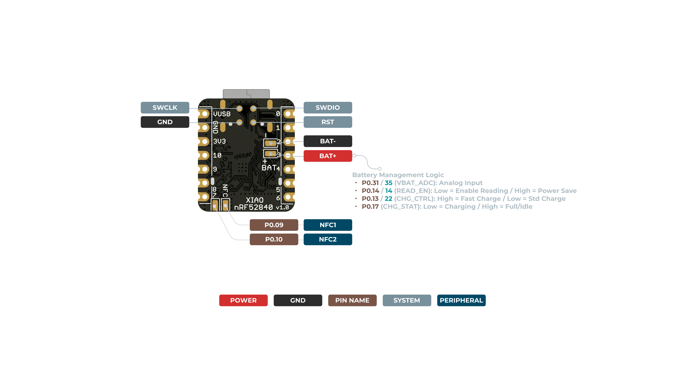

# Seeed Studio XIAO nRF52840 模块介绍与 Claude Code 指示灯方案

## 模块概览

Seeed Studio XIAO nRF52840，也常被称为 XIAO BLE，是 XIAO 系列中的小尺寸蓝牙开发板。它基于 Nordic nRF52840 MCU，板载 Bluetooth Low Energy、USB-C、2 MB 外部 Flash、电池充放电管理、复位按键和用户可编程三色 LED，适合做低功耗蓝牙外设、桌面提示灯、可穿戴设备和小型 IoT 节点。

核心特性：

- MCU：Nordic nRF52840，ARM Cortex-M4F，64 MHz。
- 无线：Bluetooth Low Energy，官方资料同时提到 Bluetooth 5.0/5.4、Bluetooth Mesh 和 NFC。
- 存储：nRF52840 片上资源 + 板载 2 MB Flash。
- 尺寸：约 21 mm x 17.8 mm，适合做桌面小配件。
- IO：11 个数字 IO，均可 PWM；6 个模拟输入；支持 UART、I2C、SPI。
- 供电：USB-C 或锂电池，板载充电管理芯片。
- 开发：支持 Arduino、MicroPython、CircuitPython 等。

> 说明：如果目标只是做 Claude Code 指示灯，普通版 XIAO nRF52840 已足够；Sense 版额外集成 IMU 和麦克风，本项目暂时用不上。

## 产品图片

官方正面图：


官方背面图：



## 引脚图

官方引脚资源：

- [Seeed Wiki: XIAO nRF52840 hardware overview](https://wiki.seeedstudio.com/XIAO_BLE/#hardware-overview)

常用排针和功能速查：

| XIAO 引脚 | 芯片引脚 | 主要功能 | Arduino 名称 |
|---|---|---|---|
| D0 | P0.02 | GPIO, AIN0 | 0 |
| D1 | P0.03 | GPIO, AIN1 | 1 |
| D2 | P0.28 | GPIO, AIN4 | 2 |
| D3 | P0.29 | GPIO, AIN5 | 3 |
| D4 | P0.04 | GPIO, SDA, AIN2 | 4 |
| D5 | P0.05 | GPIO, SCL, AIN3 | 5 |
| D6 | P1.11 | GPIO, UART TX | 7/6 |
| D7 | P1.12 | GPIO, UART RX | 8/7 |
| D8 | P1.13 | GPIO, SPI SCK | 9/8 |
| D9 | P1.14 | GPIO, SPI MISO | 10/9 |
| D10 | P1.15 | GPIO, SPI MOSI | 11/10 |
| 3V3 | - | 3.3 V 输出 | - |
| 5V | - | USB VBUS 输入/输出 | - |
| GND | - | 地 | - |

板载用户 RGB LED：

| LED | 芯片引脚 | Arduino 名称 | 逻辑 |
|---|---|---|---|
| Red | P0.26 | LED_RED / 11 | LOW 亮，HIGH 灭 |
| Green | P0.30 | LED_GREEN / 12 或 13 | LOW 亮，HIGH 灭 |
| Blue | P0.06 | LED_BLUE / 13 或 12 | LOW 亮，HIGH 灭 |

注意：XIAO nRF52840 的板载三色 LED 是共阳极控制逻辑，和当前 ESP32-C3 + 共阴 RGB 模块相反。当前项目外接共阴 RGB 是 `HIGH = 亮`，XIAO 板载 RGB 是 `LOW = 亮`。如果继续用外接共阴 RGB 模块，可把 RGB 分别接到 D0/D1/D2，并沿用 `HIGH = 亮` 逻辑。

推荐接线：

| 用法 | R | G | B | 说明 |
|---|---|---|---|---|
| 使用板载 RGB | LED_RED | LED_GREEN | LED_BLUE | 最少硬件，适合快速验证 |
| 使用外接共阴 RGB 模块 | D0 | D1 | D2 | 效果更醒目，逻辑与现有项目一致 |

## BLE 方案概述

本方案完全基于 BLE (Bluetooth Low Energy) 通信，不使用 USB 串口。XIAO nRF52840 作为 BLE Peripheral，电脑端 Claude Code hook 作为 BLE Central，通过 GATT characteristic 写入状态命令控制 LED。

为什么选择纯 BLE：

- nRF52840 原生支持 BLE，做低功耗常在线指示灯是它的强项。
- 无线连接，开发板可以放在桌面任何位置，不受 USB 线长度限制。
- 支持电池供电，搭配板载充电管理可做成完全无线的桌面指示灯。
- Claude Code hook 每次只发送短命令（如 `STATE:tool`），对 BLE 吞吐和延迟要求极低。
- 使用 Python `bleak` 库处理跨平台 BLE 通信，macOS / Windows / Linux 统一接口。
- 保留与 ESP32-C3 方案一致的状态协议，降低迁移成本。

依赖：`pip install bleak`（跨平台 BLE 客户端库）

注意事项：

- 首次连接需要系统蓝牙已开启，macOS 可能弹出蓝牙权限弹窗。
- Claude Code hook 要 fail fast：找不到设备或写入失败时快速退出，不阻塞主流程。
- BLE 连接断开后 hook 需要自动重连，`bleak` 提供了相应的 API 支持。

## Claude Code 指示灯实现方案

### 状态协议

沿用与 ESP32-C3 方案一致的状态协议，通过 BLE GATT 写入文本命令：

```text
STATE:idle
STATE:done
STATE:running
STATE:tool
STATE:ask
STATE:error
PING
HELP
```

状态映射保持不变：

| Hook Event | State | LED 效果 |
|---|---|---|
| SessionStart / SessionEnd | idle | 绿灯常亮 |
| UserPromptSubmit | running | 蓝灯慢闪，500 ms |
| PreToolUse | tool | 紫灯快闪，150 ms |
| PermissionRequest / Notification(ask) | ask | 黄灯快闪，250 ms |
| PostToolUseFailure / PermissionDenied | error | 红灯快闪，100 ms |
| Stop | done | 绿灯常亮 |

### 固件设计

固件分成三层：

1. `StateParser`：解析 `STATE:*`、`PING`、`HELP`，非法命令立即返回错误。
2. `LedDriver`：根据使用板载 RGB 或外接共阴 RGB，封装亮灭逻辑。
3. `BLETransport`：BLE GATT 服务，接收 Central 写入的命令，交给 parser 处理。

推荐 BLE GATT 设计：

| 项 | 建议 |
|---|---|
| Device name | `ClaudeCodeRGB-nRF52840` |
| Service UUID | 自定义 128-bit UUID |
| RX Characteristic | Write / Write Without Response，用于接收 `STATE:*` |
| TX Characteristic | Notify，可选，用于返回 `OK STATE:*` 或错误 |

### 桌面端 hook 设计

使用 `bleak` 库实现 BLE Central，核心流程：扫描设备 → 建立连接 → 写入状态命令。

```python
# Core flow sketch (not complete implementation)
import asyncio
from bleak import BleakClient, BleakScanner

SERVICE_UUID = "自定义 128-bit UUID"
RX_CHAR_UUID = "自定义 128-bit UUID"
DEVICE_NAME = "ClaudeCodeRGB-nRF52840"

async def send_state(state: str):
    device = await BleakScanner.find_device_by_name(DEVICE_NAME, timeout=5.0)
    if not device:
        return  # fail fast
    async with BleakClient(device) as client:
        await client.write_gatt_char(RX_CHAR_UUID, f"STATE:{state}".encode())
```

环境变量配置：

| 环境变量 | 示例 | 说明 |
|---|---|---|
| `CLAUDE_RGB_BLE_NAME` | `ClaudeCodeRGB-nRF52840` | BLE 设备名，用于扫描过滤 |
| `CLAUDE_RGB_BLE_SERVICE_UUID` | 自定义 UUID | 服务 UUID |
| `CLAUDE_RGB_BLE_RX_UUID` | 自定义 UUID | 写入 characteristic UUID |
| `CLAUDE_RGB_LOG` | 日志路径 | 可选，调试时使用 |

fail fast 原则：

- 扫描超时未找到设备：记录错误，快速退出，不阻塞 Claude Code。
- 连接失败或写入失败：记录错误，快速退出。
- 状态名非法：立即退出并记录错误。

fail fast 原则：

- 状态名非法：立即退出并记录错误。
- 找不到 BLE 设备：记录错误，快速退出，不阻塞 Claude Code。
- 写入失败：记录错误，快速退出；不吞掉开发阶段的异常信息，但不要让灯控失败拖慢主任务。

### 推荐落地顺序

1. 编写 XIAO nRF52840 固件：BLE GATT 服务 + LED 驱动 + 状态解析。
2. 先用手机 BLE 调试工具（如 nRF Connect）写入 `STATE:running` 验证固件。
3. 编写桌面端 BLE hook 脚本，使用 `bleak` 实现设备扫描和命令写入。
4. 整合 Claude Code hooks 配置，验证完整链路。
5. 编写安装脚本，自动安装 `bleak` 依赖并配置 hooks。

### 推荐硬件方案

最小方案：

- XIAO nRF52840 x 1
- USB-C 数据线 x 1
- 使用板载 RGB LED

增强方案：

- XIAO nRF52840 x 1
- 共阴 RGB LED 模块 x 1
- R/G/B 分别接 D0/D1/D2，GND 接 GND
- 每个颜色通道建议串联限流电阻；若使用现成 RGB 模块，确认模块是否已带电阻

## 和 ESP32-C3 方案对比

| 维度 | ESP32-C3 SuperMini | XIAO nRF52840 |
|---|---|---|
| 通信方式 | USB 串口 | BLE 无线 |
| 连接线 | 必须插 USB | 无线，可电池供电 |
| 桌面依赖 | 无（stdlib only） | bleak（pip install） |
| 功耗 | 较高 | 更低，适合电池方案 |
| 板载 RGB | 依板型而定 | 有用户可编程三色 LED |
| 部署复杂度 | 低 | 中等（需配对/权限） |

ESP32-C3 方案适合追求简单即插即用；XIAO nRF52840 + BLE 方案适合想要无线、低功耗、桌面无多余线缆的场景。

## 参考资料

- [Seeed Studio XIAO nRF52840 官方商品页](https://www.seeedstudio.com/Seeed-XIAO-BLE-nRF52840-p-5201.html)
- [Seeed Wiki: Getting Started with Seeed Studio XIAO nRF52840 Series](https://wiki.seeedstudio.com/XIAO_BLE/)
- [Seeed Wiki 中文版: XIAO nRF52840 系列入门指南](https://wiki.seeedstudio.com/cn/XIAO_BLE/)
- [Nordic nRF52840 Datasheet](https://files.seeedstudio.com/wiki/XIAO-BLE/nRF52840_PS_v1.5.pdf)
